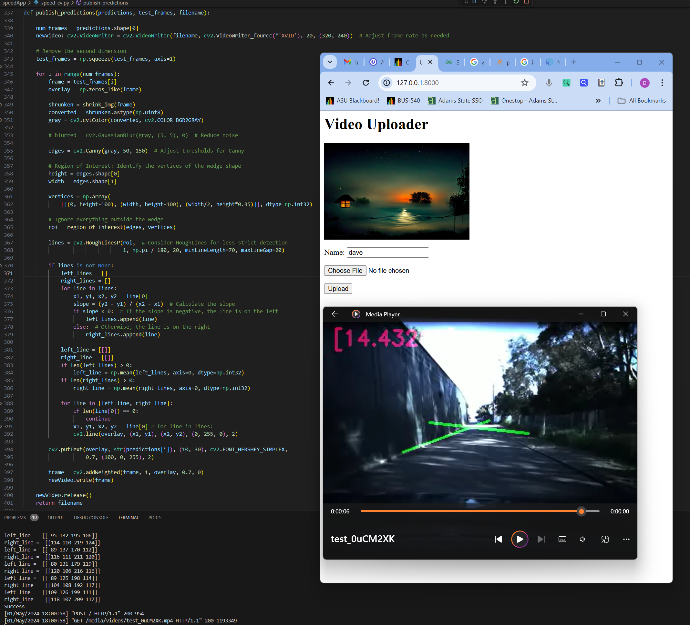
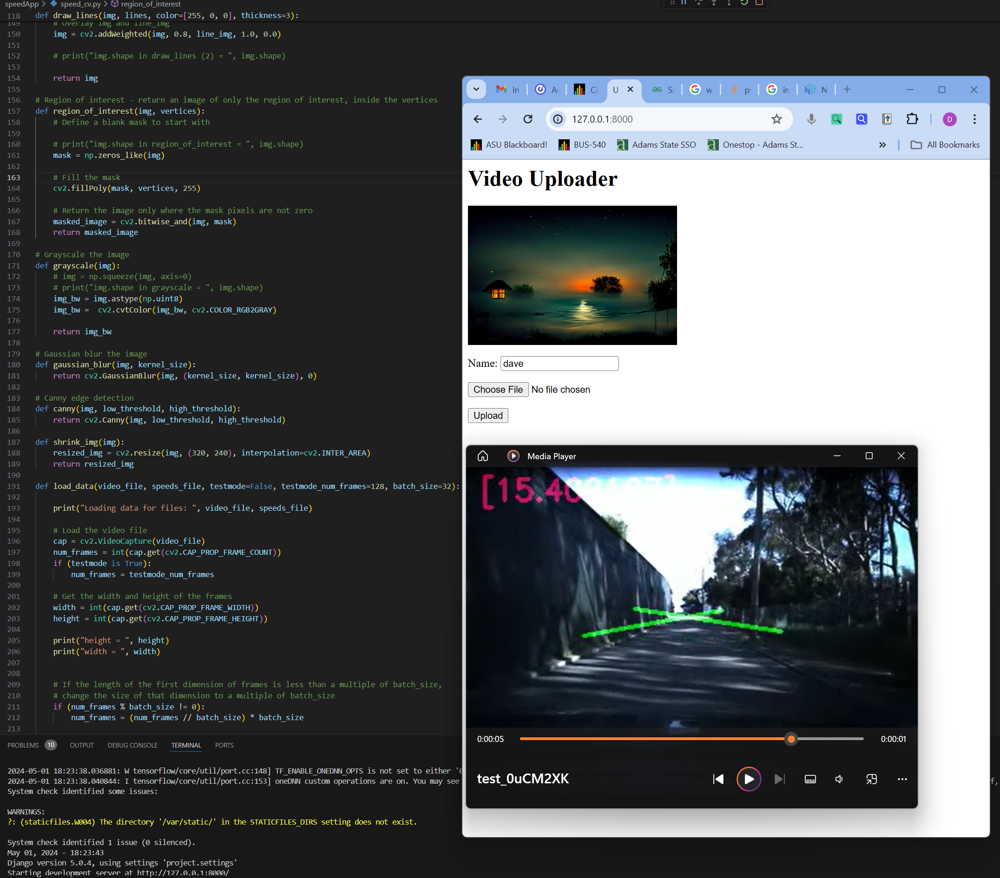

# SpeedApp

This is a Django app and console app designed to create a Sequential model if needed, based on training data, and then predict the target value for a given input data. The web form allows video upload.

The output speed prediction for a given video file will be superimposed on the video and saved as a new video file, which is then displayed on the web page.

**Author:** Norton 2023  
**Project:** AI/Machine Learning capstone project - Speed and Lane Detection  
**Objective:** Use Keras to train a model which can predict speed and laneline direction.

### Miscellaneous

- Speed prediction AI is trained using Conv2D+TimeDistributed layers in a Sequential model (Keras)
- Lane prediction AI is implemented with Hough Transform and OpenCV.
- Runs in a Django web container, with a single HTML page for video submission.

### Version History:

- 0.001 - Feb 2024: Initial version
- 0.002 - Feb 2024: Django WSGI app, more reporting
- 0.003 - May 2024: Fine tuning of model (including lane-direction prediction and speed prediction)
- 0.004 - May 2024: Prepare web response for async display to user after superimposing speed and lane predictions
- 0.005 - May 2024: Prepare for publishing, cleanup and final testing